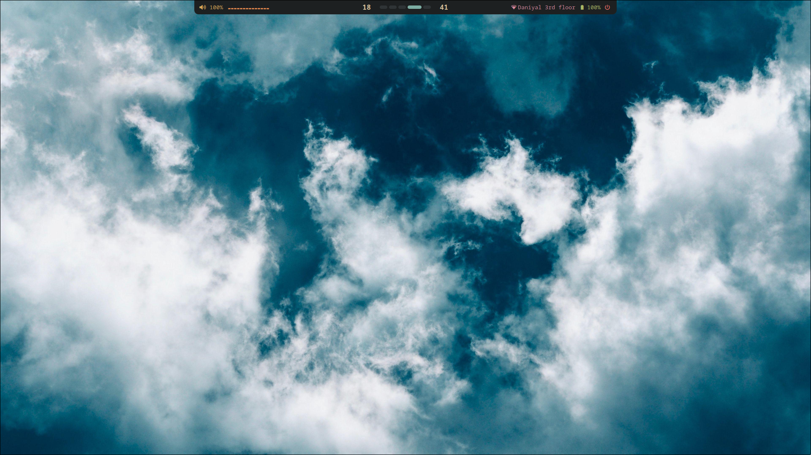
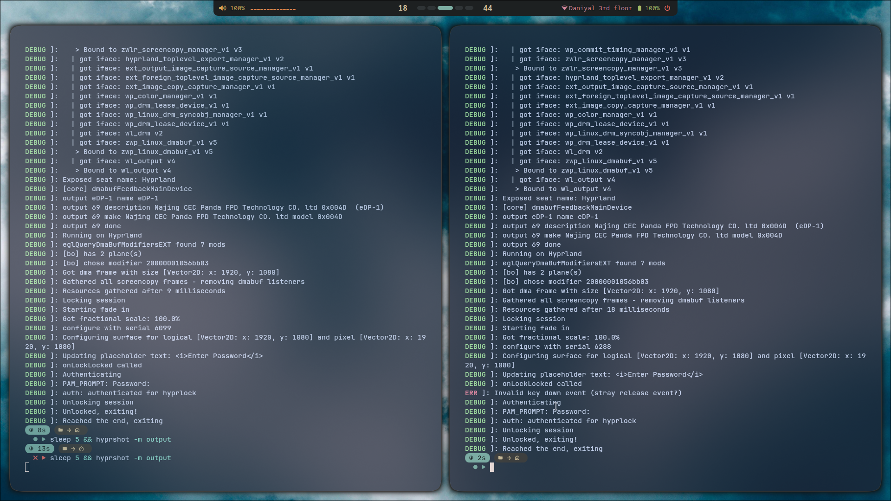
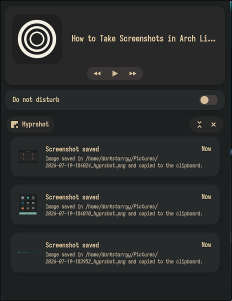
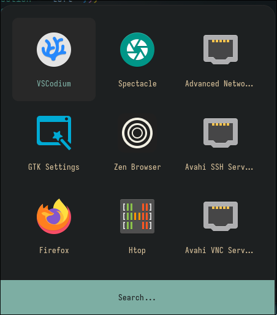
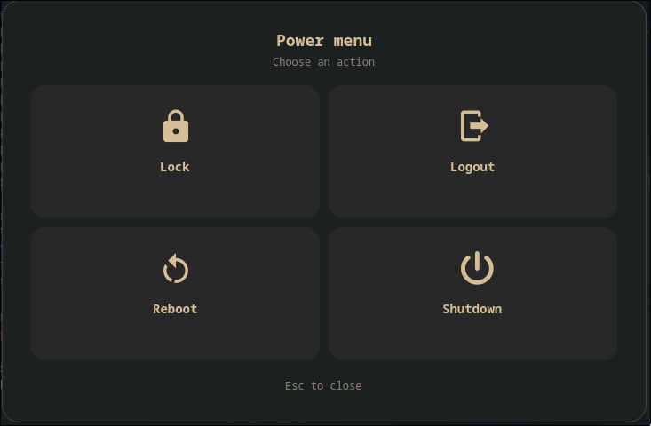

````markdown

 ██████╗██╗   ██╗███╗   ███╗██╗   ██╗██╗     ██╗   ██╗███████╗
██╔════╝██║   ██║████╗ ████║██║   ██║██║     ██║   ██║██╔════╝
██║     ██║   ██║██╔████╔██║██║   ██║██║     ██║   ██║███████╗
██║     ██║   ██║██║╚██╔╝██║██║   ██║██║     ██║   ██║╚════██║
╚██████╗╚██████╔╝██║ ╚═╝ ██║╚██████╔╝███████╗╚██████╔╝███████║
 ╚═════╝ ╚═════╝ ╚═╝     ╚═╝ ╚═════╝ ╚══════╝ ╚═════╝ ╚══════╝

````

A brisk and frugal Hyprland rice.

## 📸 Screenshots

Take a look at Cumulus in action.

| Desktop | Terminal |
|:--------:|:--------:|
|  |  |
| **Desktop**<br>The default Cumulus desktop featuring a minimal Waybar, rounded corners, soft transparency, and a calm blue aesthetic. | **Terminal**<br>Kitty configured with rounded transparency, Catppuccin-inspired colors, and a clean development-focused layout. |

| Notification Center | Application Launcher |
|:-------------------:|:--------------------:|
|  |  |
| **SwayNC**<br>Elegant notification center with media controls, Do Not Disturb toggle, and screenshot history. | **Rofi Launcher**<br>Minimal application launcher with a spacious grid layout and integrated search. |

| Waybar | AGS Power Menu |
|:-------:|:--------------:|
|  |  |
| **Waybar**<br>A sleek top bar displaying workspaces, system status, media, battery, and network information. | **AGS Power Menu**<br>A clean and distraction-free power menu for locking, logging out, rebooting, and shutting down. |

## 🚀 Installation

> **Requirements**
>
> - Arch Linux
> - Internet connection
> - `git`
> - `sudo`

Clone the repository and run the installer:

```bash
git clone https://github.com/Daniyal421/Cumulus.git
cd Cumulus

chmod +x scripts/*.sh
./scripts/install.sh
```

The installer will automatically:

- 📦 Update your system
- 📥 Install official packages
- 🌿 Install `yay` (if required)
- 📚 Install AUR packages
- 💾 Back up your existing configuration
- ⚙️ Deploy the Cumulus configuration
- 🔄 Refresh the font cache

> **⚠️ Warning**
>
> Cumulus is intended for **Arch Linux** and its derivatives. Existing configuration files are backed up before installation to:
>
> `~/.local/share/cumulus/backups/`
 
